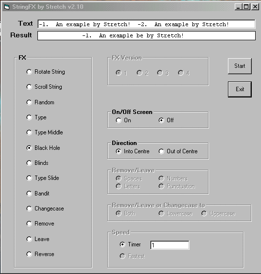



## StringFX v2\.10

### Description

This is an update of version 2.00 that I have done today. Because of some complaints of the speed I have added a speed option which includes "Fastest" (but this only works for options 8 to 12 as the others are so fast you cannot see them work!!) I have added a new FX called "Black Hole" where the text dissapears in to, or out of, the centre of the string. There are now 2 Bandits. The new 2nd one cycles through all the characters at the same time, compared to number 1 which did them one at a time. It should be noted that this is also an example of Framed Options; diabling and enabling them and discovering which have been selected by the user. Also in the Speed textbox you can only enter numbers (I got that off here, but hey!) Although I wrote this in VB5, I see no reason why it will not work in ANY of the other versions as it only uses basic commands like MID and MID$. (Although I am not sure when the MID command came in...) Please rate this!! and I would be interested in any comments you may have. Thanx!
 
### More Info
 
Onscreen

             |
---                |---
**Submitted On**   |2000-05-11 21:22:40
**By**             |[Sentinel](https://github.com/Planet-Source-Code/PSCIndex/blob/master/ByAuthor/sentinel.md)
**Level**          |Beginner
**User Rating**    |4.9 (49 globes from 10 users)
**Compatibility**  |VB 5\.0, VB 6\.0
**Category**       |[String Manipulation](https://github.com/Planet-Source-Code/PSCIndex/blob/master/ByCategory/string-manipulation__1-5.md)
**World**          |[Visual Basic](https://github.com/Planet-Source-Code/PSCIndex/blob/master/ByWorld/visual-basic.md)
**Archive File**   |[CODE\_UPLOAD57035112000\.zip](https://github.com/Planet-Source-Code/sentinel-stringfx-v2-10__1-8018/archive/master.zip)

